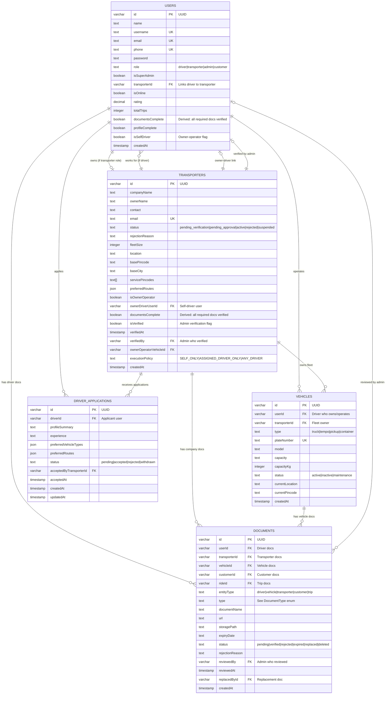

# Waykel Entity Relationship Diagram

## Data Model: Transporter, Vehicle, Driver, Documents & Verification



## Key Data Relationships

### Ownership Hierarchy
1. **Transporter** owns **Vehicles** (fleet)
2. **Transporter** employs **Drivers** (Users with role=driver, transporterId set)
3. **Self-Driver (Owner-Operator)**: User is both driver AND transporter owner
   - `transporters.ownerDriverUserId` → `users.id`
   - `users.isSelfDriver = true`

### Document Scoping
Documents are polymorphic, linked to ONE of:
- `userId` → Driver documents (DL, Aadhar, PAN)
- `transporterId` → Company documents (GST, Trade License)
- `vehicleId` → Vehicle documents (RC, Insurance, Permit)
- `rideId` → Trip documents (POD, Invoice, E-way Bill)

### Approval Status Derivation

| Entity | Status Field | Derived From |
|--------|--------------|--------------|
| **Transporter** | `status` | Admin workflow: `pending_verification` → `pending_approval` → `active` |
| **Transporter** | `documentsComplete` | All required docs have `status='verified'` |
| **Transporter** | `isVerified` | Admin explicitly verified (sets `verifiedBy`, `verifiedAt`) |
| **Driver (User)** | `documentsComplete` | All required docs have `status='verified'` |
| **Vehicle** | `status` | `active`/`inactive`/`maintenance` (operational status, not verification) |
| **Document** | `status` | Admin review: `pending` → `verified`/`rejected` |

### No Orphan States
- A Vehicle MUST belong to a Transporter (`transporterId` required)
- A Driver (role=driver) with `transporterId` is employed; without is freelance
- Documents are always scoped to exactly one entity via `entityType`

### No Duplication
- Each document row represents ONE document for ONE entity
- `replacedById` handles document re-uploads (old doc marked `replaced`)
- Phone numbers are unique across all users
- Plate numbers are unique across all vehicles

## Document Types by Entity

```
DRIVER DOCUMENTS:
  - DRIVING_LICENSE
  - AADHAR_CARD
  - PAN_CARD
  - DRIVER_PHOTO

TRANSPORTER DOCUMENTS:
  - GST_CERTIFICATE
  - COMPANY_PAN
  - TRADE_LICENSE
  - COMPANY_REGISTRATION

VEHICLE DOCUMENTS:
  - RC_BOOK (Registration Certificate)
  - INSURANCE
  - PERMIT
  - FITNESS_CERTIFICATE
  - PUC_CERTIFICATE

TRIP DOCUMENTS:
  - POD (Proof of Delivery)
  - INVOICE
  - EWAY_BILL
  - WEIGHT_SLIP
  - LOADING_PHOTO
  - UNLOADING_PHOTO
```
