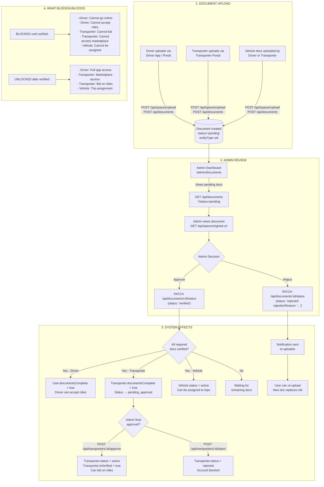
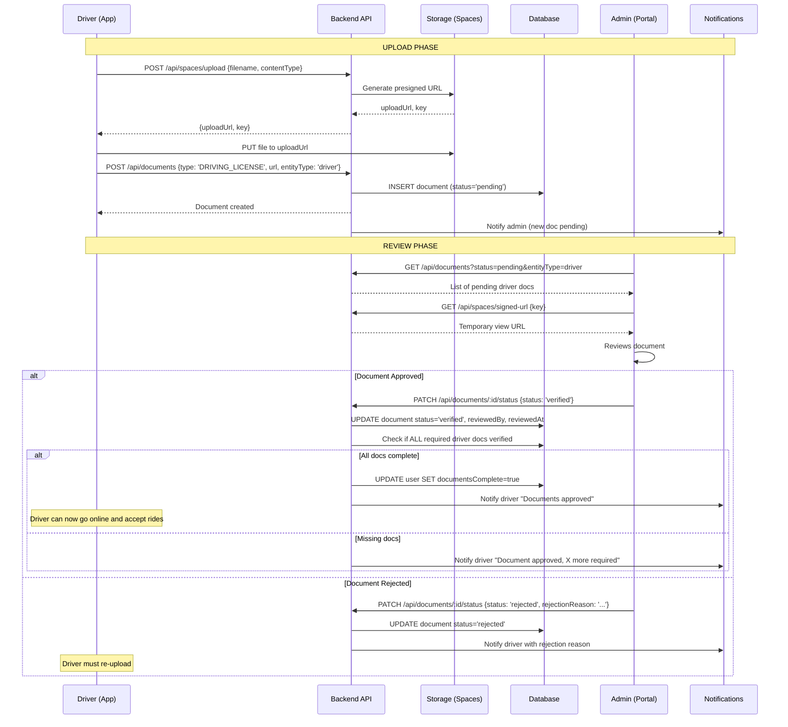
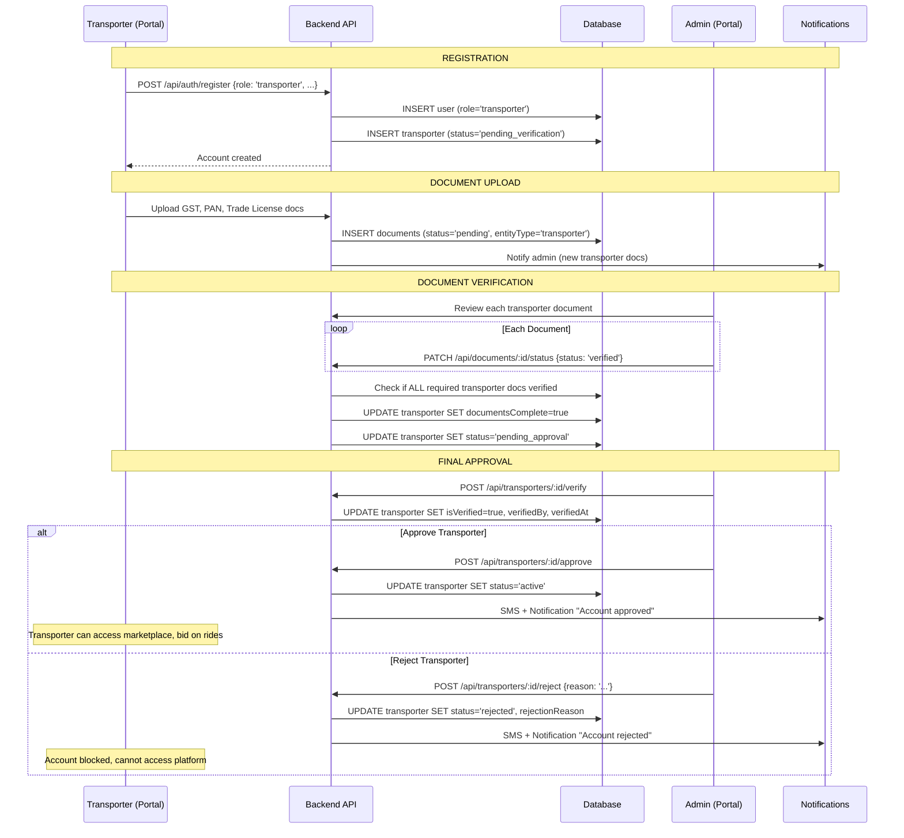
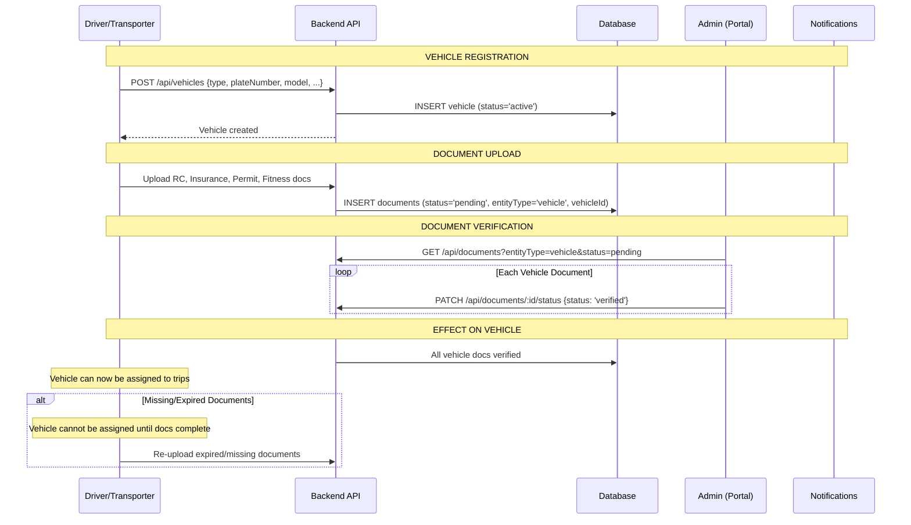

# Waykel Verification Flow Diagram

## Document Upload → Admin Review → Approve/Reject → System Effects



## Detailed Flow by Entity Type

### Driver Verification Flow



### Transporter Verification Flow



### Vehicle Verification Flow



## API Endpoints That Enforce Verification

| Endpoint | Check | Blocks If |
|----------|-------|-----------|
| `POST /api/bids` | `transporter.status === 'active'` | Transporter not approved |
| `GET /api/transporter/marketplace` | `transporter.status === 'active'` | Transporter not approved |
| `PATCH /api/rides/:id/accept` | `user.documentsComplete === true` | Driver docs incomplete |
| `PATCH /api/rides/:id/assign` | Vehicle docs complete | Vehicle docs missing |
| `POST /api/rides` (assign) | Both driver + vehicle verified | Either incomplete |

## Verification Status Summary

```
TRANSPORTER STATUS FLOW:
  pending_verification → (upload docs) → pending_approval → (admin review) → active
                                                        ↘ rejected

DOCUMENT STATUS FLOW:
  pending → (admin review) → verified
                          ↘ rejected → (re-upload) → pending (new doc)
                                                   ↘ replaced (old doc)

DRIVER COMPLETION:
  documentsComplete = false → (all docs verified) → documentsComplete = true

VEHICLE ASSIGNMENT ELIGIBILITY:
  All vehicle docs verified = Can be assigned to trips
  Any doc pending/rejected = Cannot be assigned
```

## Who Uploads, Who Reviews, What Unlocks

| Entity | Who Uploads | Where Admin Reviews | What Unlocks After Approval |
|--------|-------------|---------------------|----------------------------|
| **Driver** | Driver via App | Admin Portal → Documents | Go online, Accept rides |
| **Transporter** | Transporter via Portal | Admin Portal → Documents → Transporters | Marketplace access, Bidding |
| **Vehicle** | Driver or Transporter | Admin Portal → Documents | Trip assignment eligibility |
| **Trip** | Driver during trip | Admin Portal → Trips → Documents | Trip completion, Payment release |
